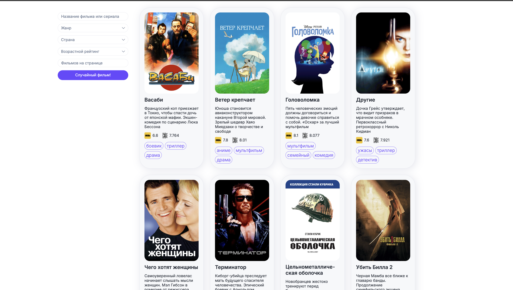
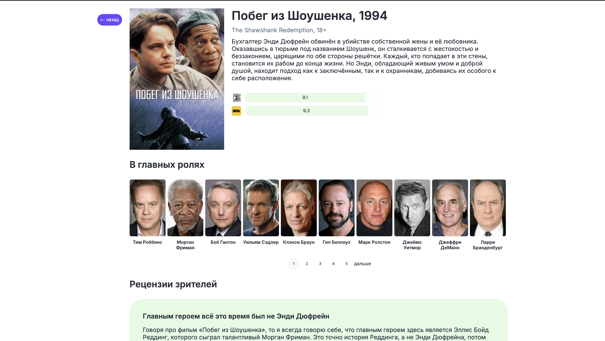

Тестовое задание на стажировку «Авито» — фронтенд приложения для быстрого поиска информации по фильмам и сериалам с платформы «Кинопоиска».
Состоит из двух страниц: списка всех фильмов и страницы отдельного.

## Стек
     

## Запуск
1. Клонируйте репозиторий:

   `git clone https://github.com/alllenk1/frontend-trainee-assignment-2024`
2. Перейдите в папку проекта:

   `cd frontend-trainee-assignment-2024`
3. Установите зависимости:

   `npm install`
4. Запустите проект [со своим API-ключом](https://t.me/kinopoiskdev_bot) или попросите [мой](https://t.me/allenk1):

   `TOKEN=<your api token> npm run start`

   Например:

   `TOKEN=1111-2222-3333-4444 npm run start`

## Список фильмов

* Отображается список фильмов и сериалов.
* Есть пагинация.
* Можно выбрать количество фильмов на странице (по умолчанию 10).

  [Пример на видео](https://disk.yandex.ru/client/disk/frontend-trainee-assignment-2024?idApp=client&dialog=slider&idDialog=%2Fdisk%2Ffrontend-trainee-assignment-2024%2F%D1%81%D0%BF%D0%B8%D1%81%D0%BE%D0%BA%20%D1%84%D0%B8%D0%BB%D1%8C%D0%BC%D0%BE%D0%B2%20%D0%B8%20%D0%BF%D0%B0%D0%B3%D0%B8%D0%BD%D0%B0%D1%86%D0%B8%D1%8F.mov)
* Можно отфильтровать выдачу (по году, стране и возрастному рейтингу).
* Есть поиск по названию. При вводе значений подсказки фильтруются по вхождению (например, «бой» — «прибой», «бойкий», «бесперебойность»). Есть дебаунс, чтобы поиск не выполнялся после ввода каждого символа.
* Можно перейти на страницу фильма из выдачи.

  [Пример на видео](https://disk.yandex.ru/client/disk/frontend-trainee-assignment-2024?idApp=client&dialog=slider&idDialog=%2Fdisk%2Ffrontend-trainee-assignment-2024%2F%D1%84%D0%B8%D0%BB%D1%8C%D1%82%D1%80%D1%8B%20%D0%B8%20%D0%BF%D0%BE%D0%B8%D1%81%D0%BA.mov)
* Релизована кнопка «Случайный фильм», которая ведет на рандомный фильм из базы.

## Страница фильма

* Отображается информация о фильме или сериале, в том числе:
    * название,
    * описание,
    * рейтинг,
    * список актёров (с пагинацией, если их больше 10),
    * отзывы пользователей (с пагинацией),
    * постеры (в виде «карусели»).
* Реализована карусель с похожими фильмами. По каждому элементу можно кликнуть и открыть его страницу.
* Если какой-нибудь список пуст, выводится заглушка.
* Есть кнопка «назад», которая ведет на выдачу.

  [Пример на видео](https://disk.yandex.ru/client/disk/frontend-trainee-assignment-2024?idApp=client&dialog=slider&idDialog=%2Fdisk%2Ffrontend-trainee-assignment-2024%2F%D1%81%D1%82%D1%80%D0%B0%D0%BD%D0%B8%D1%86%D0%B0%20%D1%84%D0%B8%D0%BB%D1%8C%D0%BC%D0%B0.mov)
